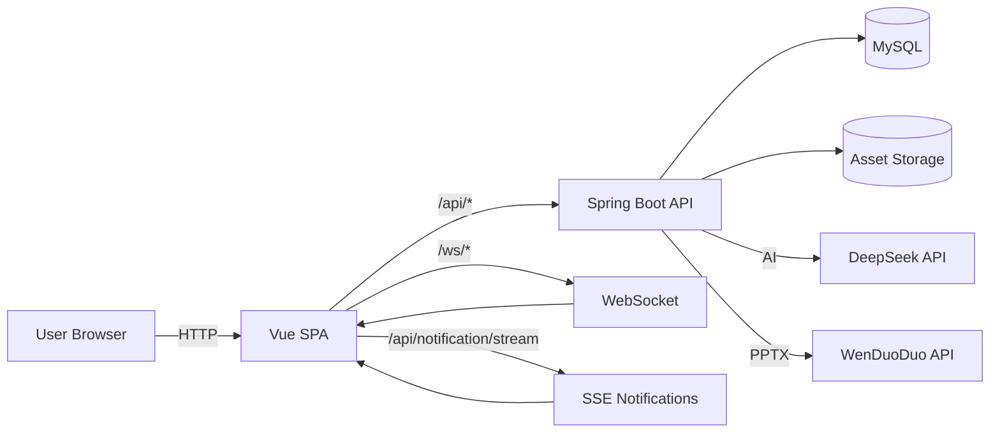

**本项目为个人原创作品集，禁止未经授权的商业部署与商业化盈利，仅供技术学习与交流。转载、二次分发必须注明原仓库完整来源。**

一个面向团队的智能开发者工作台：把「项目管理 + 协作闭环 + AI 对话内落地」整合到一套产品里，让“计划”可执行、让“执行”可追溯、让“交付”可验收。

> 作品集定位：这是一个“能跑、能演示、能讲清架构”的完整产品型项目，而不是页面 Demo 或脚手架拼装。

**关键词**：Workspace · Task/Checklist/Deliverable · Kanban · Milestone · Inbox · Audit · WebSocket Presence · SSE Notifications · In-chat AI Apply

***

## 目录

[作品集亮点](#portfolio) · [功能概览](#features) · [架构与数据流](#architecture) · [快速开始](#quickstart) · [部署](#deploy) · [上传前检查](#preflight) · [FAQ](#faq) · [商业化](#license) 

如果你一直在用 Jira/飞书/Notion/各类看板 + 一堆 Chat 工具拼起来做项目管理，这个项目想解决的就是一个更“闭环”的问题：

- 任务不只是写标题：它要能拆子任务、挂交付物、带验收清单、支持附件与评论协作
- 协作不只是“通知”：它要能沉淀到收件箱、项目动态、审计日志，并能被清理/导出
- AI 不只是“给建议”：它要能在对话里把计划落地到系统里（创建任务/清单/交付物），并且可控、可回滚、可验证

***

## 作品集亮点

### 1) 产品闭环，不是“任务列表”

- 任务有明确的交付结构：子任务 + 验收清单 + 交付物（Link/Doc/PR）+ 附件 + 评论协作
- 看板拖拽推进 + 稳定排序，让状态流转不是摆设
- 里程碑聚合版本任务，天然适配“迭代交付”的工作方式

### 2) 协作与可追溯（可讲清的“数据与事件链路”）

- WebSocket Presence：成员在看/编辑提示（更接近协作产品的“在场感”）
- 审计日志：关键操作留痕（并提供导出能力，方便交付/合规/复盘）
- Inbox：把通知变成“可处理的待办”，避免信息只在弹窗里消失

### 3) AI 不止聊天：对话内“计划 → 确认 → 落地”

本项目的 AI 方向是把建议落地成系统动作（创建任务/清单/交付物等），并且通过确认机制保持可控。

- Plan：把需求拆成任务结构（并控制输出长度）
- Apply：确认后创建任务与相关结构
- 周报 / Release Notes / Gate / Inbox 分流：以“预览 → 确认 → 执行”完成协作闭环

### 4) 技术栈现代但克制（适合面试讲解）

- 前端：Vue 3 + TS + Pinia + Vite + Naive UI + TailwindCSS（偏产品化 UI）
- 后端：Java 17 + Spring Boot 3 + MyBatis-Plus + MySQL（清晰分层、易扩展）
- 实时：WebSocket + SSE + 跨标签页兜底（能讲清“为什么实时不会乱/不会漏”）

### 5) 你可以怎么演示（建议录 60–90 秒视频）

建议录屏顺序（面试官最爱看这种“闭环链路”）：

1. Workspace 创建项目 → 进入项目
2. AI Chat 输入需求 → 生成 plan → 确认落地创建任务
3. 打开 Kanban 拖拽推进一个任务到 DONE
4. 进入 Task Detail 勾选 checklist、挂 deliverable、上传附件
5. 打开 Inbox 批量处理一条待办
6. 打开 Audit 导出（或展示关键操作留痕）

***

## 功能概述

### 你会得到什么

- **工作台（Workspace）**：项目列表、我的工作、AI 需求拆解与落地入口聚合（更接近“研发作战台”的体验）
- **任务闭环（Task）**：子任务、交付物、验收清单、评论与 @、附件上传与在线预览
- **看板（Kanban）**：TODO/DOING/DONE 三列拖拽移动、拖拽重排、稳定排序
- **里程碑（Milestone）**：围绕版本/阶段聚合任务进度，并支持 Release Notes 草拟与资产化
- **收件箱（Inbox）**：把“需要我处理”的东西统一收拢，支持批量已读/已处理与定位跳转
- **审计日志 & 项目动态**：关键操作留痕，支持导出 CSV；动态/日志支持清理，避免越用越臃肿
- **实时协作（Realtime）**：WebSocket presence（在看/编辑提示）+ 事件广播；跨标签页刷新兜底
- **AI 对话内落地（In-chat Agent）**：
  - 对话里产出计划（plan），再“确认落地”创建任务/清单/交付物
  - 周报草拟 → 确认后入库
  - Release Notes 草拟 → 确认后入库
  - Gate 检查（缺清单/缺交付物/未完成）→ 确认后一键补齐占位
  - Inbox 分流 → 确认后批量处理

### 功能矩阵（摘要）

| 模块               | 你能做什么                       | 典型价值            |
| ---------------- | --------------------------- | --------------- |
| Workspace        | 一屏掌控项目与我的工作；AI 拆解需求并落地      | 不用在多个页面来回跳      |
| Task             | 子任务/清单/交付物/附件/评论/通知         | 从“记录”变成“交付闭环”   |
| Kanban           | 拖拽移动、拖拽排序、稳定顺序              | 状态推进更顺滑         |
| Milestone        | 聚合版本任务；支持 Release Notes 草拟  | 版本交付更可控         |
| Inbox            | 聚合待处理；批量处理；跳转定位             | 不漏事、不刷屏         |
| Audit & Activity | 留痕、导出、可清理                   | 更专业、更可追溯        |
| AI Chat          | 计划/确认/落地/撤销；周报/发布说明/Gate/分流 | AI 参与执行而不是只输出文字 |

***

## 截图 

网站首页：

1. Workspace：三列卡片（Projects / My Work / Planner）

2. Kanban：拖拽移动与排序
 
3. Task Detail：清单 + 交付物 + 附件预览 + 评论区

4. Inbox：批量处理 + 跳转定位
5. Audit：审计日志导出与清理入口
6. AI Chat：Plan → 确认 → 落地

***

## 适用人群与场景

- **个人/小团队**：想要轻量但完整的“从需求到交付”闭环，不想上来就搭一堆重系统
- **外包/交付团队**：交付物与验收清单更可控，过程记录与审计更可追溯
- **研发负责人/PM**：想要把“版本里程碑 → 任务推进 → 发布说明”串起来，减少手工汇总
- **AI 辅助研发探索**：关注“把 AI 的建议落地成系统动作”，避免“口头成功”

***

## 设计理念

### 1) 闭环优先，而不是功能堆叠

很多系统都能“记录任务”，但交付过程中真正痛的是：

- 任务是否有验收清单？是否真的做完？有没有关键链接/PR/文档？
- 过程信息在哪里？是散落在 IM、评论区、群里，还是能沉淀且可检索？
- 版本发布说明谁来写？怎么从任务/交付物自动聚合？

DevTool Copilot 的核心目标是：**让交付可验证，让协作可追溯，让信息可沉淀**。

### 2) AI 必须在“对话里”落地

AI 不是一个“独立页按钮”，而是一个持续对话的执行伙伴：

- 你用自然语言说需求，它帮你拆成可执行任务
- 你确认后，它调用系统接口把任务创建出来
- 你能撤销/回滚它刚做的动作
- 它帮你做周报、发布说明、Gate 检查与 Inbox 分流，但需要你确认

***

## 模块地图（路由）

- Workspace：`/dashboard`
- AI：`/ai`（对话 / 审查 / 历史，支持记忆最后一次状态与项目上下文）
- Inbox：`/inbox`
- Kanban：`/board`
- Projects：`/projects/:id`
- Task Detail：`/projects/:projectId/tasks/:taskId`
- Dashboard Analytics：`/dashboard`（页面内部统计面板）

***

## 架构与数据流

### 技术栈

- **前端**：Vue 3 + TypeScript + Vite + Pinia + Naive UI + TailwindCSS
- **后端**：Java 17 + Spring Boot 3 + MyBatis-Plus + MySQL
- **实时**：WebSocket（协作/Presence/事件）+ SSE（通知流）
- **文档产物**：PPTX（文多多 API），生成后按“资产”存储并支持在线预览/下载

### 系统架构（Mermaid）

### 一个“闭环动作”是怎么发生的

以 “AI 帮我把需求拆成任务并落地” 为例：

1. 前端 AI Chat 发起计划请求（SSE 流式输出，边生成边展示）
2. 用户在对话里确认“落地/创建”
3. 前端调用后端 apply 接口批量创建任务/清单/交付物
4. 后端写库后，通过 WebSocket 广播项目事件
5. 前端实时刷新（同 tab + 跨 tab 兜底），你不用手动刷新页面

### Realtime 说明

- **WebSocket**：
  - Presence：成员在看/在编辑提示（viewType/viewId + editing + heartbeat）
  - 项目事件：创建/更新/移动看板/评论等事件广播
- **SSE**：
  - 通知流：更像“站内通知中心”的实时推送
- **跨标签页兜底**：
  - BroadcastChannel / localStorage 事件，保证在多开标签页时也能同步刷新

***

## 快速开始

### 先决条件

- Node.js（用于前端）
- Java 17 + Maven（用于后端）
- MySQL 8.x

### 后端（Spring Boot）

1. 准备 MySQL 并创建数据库：`devtool_copilot`
2. 通过环境变量覆盖配置（示例，按需覆盖）：
   - `DB_URL` / `DB_USERNAME` / `DB_PASSWORD`
   - `JWT_SECRET`（生产环境务必修改）
   - `DEEPSEEK_API_KEY`（启用 AI 对话）
   - `WENDUODUO_API_KEY`、`WENDUODUO_TEMPLATE_ID`（启用 PPTX 生成）
3. 构建并启动（默认端口 `8085`）：
   - `mvn -DskipTests package`
   - `java -jar target/devtool-copilot-backend-0.0.1-SNAPSHOT.jar`

后端完整配置项见：[application.yml](src/main/resources/application.yml)

### 前端（Vue 3 + Vite）

1. 进入目录：`devtool-copilot-web`
2. 安装依赖：`npm install`
3. 启动开发服务（将代理指向后端 `8085`）：
   - `VITE_BACKEND_URL=http://127.0.0.1:8085 npm run dev`

Windows PowerShell 若遇 `npm.ps1` 执行策略问题，可用 `npm.cmd` 运行。

***

## 部署

当前仓库已提供一套“阿里云 ECS + Nginx + RDS MySQL”的部署模板（含 WS/SSE/HTTPS 的 Nginx 配置与 systemd 守护）。

- [deploy/aliyun-ecs-nginx/README.md](deploy/aliyun-ecs-nginx/README.md)

目标形态摘要：

- 前端：Nginx 静态资源 `/var/www/devtool-copilot`
- 后端：Spring Boot jar（本机 `127.0.0.1:8085`）
- 反代：Nginx `/` → SPA；`/api/**` → 后端；`/ws/**` → WebSocket；SSE 关闭缓冲
- 数据库：RDS MySQL

***

## 仓库结构（快速定位）

- `devtool-copilot-web/`：前端（Vue 3 + Vite）
- `src/main/java/`：后端（Spring Boot）
- `src/main/resources/`：后端配置（application.yml 等）
- `deploy/`：部署模板（Nginx / systemd / env 示例）
- `mcp/devtoolcopilot-mcp/`：MCP server（简易版，用于工具调用对接）

***

## 常见问题（FAQ）

### Q1：这个项目是“项目管理工具”，还是“AI 工具”？

两者都是，但定位更偏“**研发交付闭环工具**”。AI 的设计目标不是替代你管理项目，而是把“计划/汇总/检查/分流”这些重复工作变成**可确认、可落地**的系统动作。

### Q2：AI 会不会误操作？怎么保证可控？

关键动作默认采用“先预览 → 用户确认 → 执行”的交互；同时会尽量把动作与结果做成可追溯记录（任务/清单/交付物/动态/审计）。

### Q3：为什么不做向量库/联网检索？

当前阶段优先保证产品闭环与工程可控性：先把任务/协作/落地做扎实，再按需要逐步引入更复杂的 RAG/联网检索能力。

### Q4：我能否只把前端部署成静态站点？

前端可以静态部署，但系统能力依赖后端 API（任务/协作/AI 等），仍需要后端服务与数据库。

***

## Roadmap

- **父子任务/层级任务**：更强的拆解与聚合能力
- **里程碑发布闭环增强**：从任务/交付物自动生成 Release Notes、验收清单固化
- **项目归档**：已结束项目归档与只读访问
- **部署一键化**：Docker/Compose
- **生产级观测**：日志/指标/告警与回滚策略固化
- **对外 Demo**：可公开访问的演示站点与官网页

***

## License / 商业化

All rights reserved. Commercial use requires authorization.

- 仓库对外只放“可展示的源码与文档”，敏感配置全部用 `.example` 模板
- 私有化部署/商业授权用单独协议（如私有仓库、付费授权、定制开发）

如需试用/授权/私有化部署方案，我的的联系方式：

- Email: <xsw77492@gmail.com>
- WeChat:mmlki6

***

# English

DevTool Copilot is a developer workspace that unifies project execution into one product: tasks, kanban, subtasks, milestones, deliverables & checklists, attachments, inbox, audit logs, real-time collaboration, and an in-chat AI assistant that can plan and apply changes in a controlled way.

Stack: Vue 3 + Vite (frontend), Java 17 + Spring Boot + MyBatis-Plus + MySQL (backend), WebSocket/SSE (realtime).
