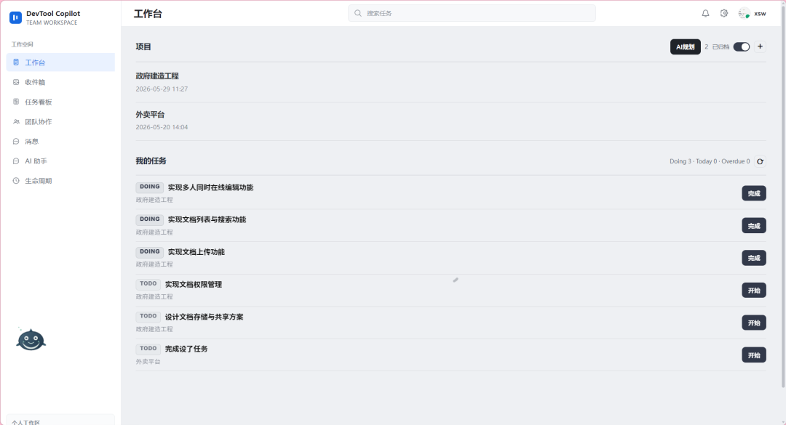
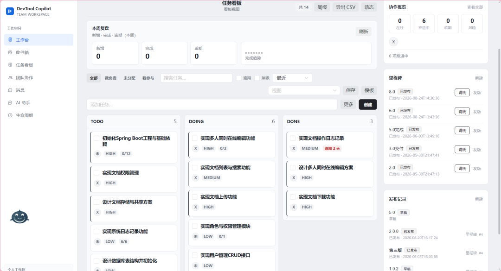
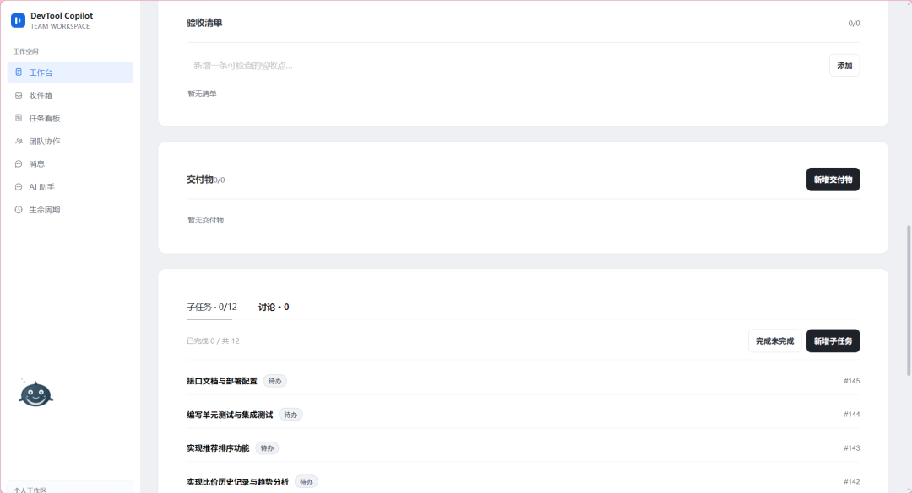
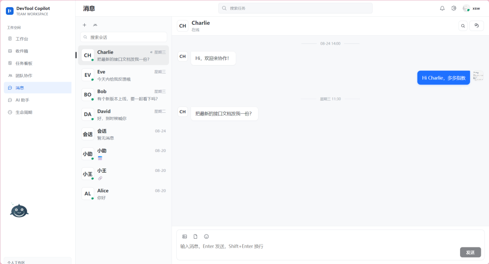
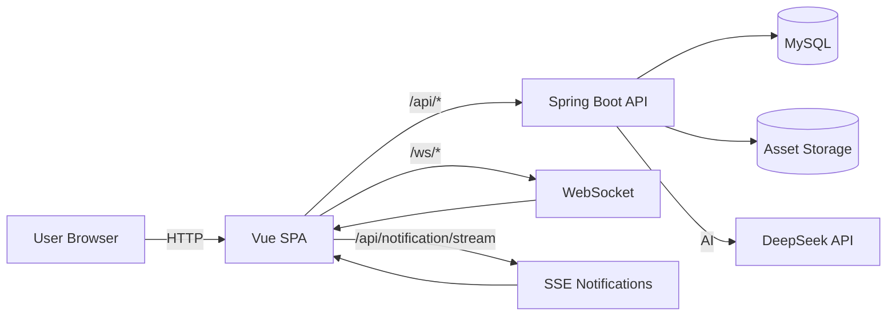

# DevTool Copilot

一个面向团队的智能开发者工作台，把「项目管理 + 协作闭环 + AI 对话内落地」整合到一套产品里，让计划可执行、执行可追溯、交付可验收。

这是一个能跑、能演示、能讲清架构的完整产品型项目，而不是页面 Demo 或脚手架拼装。

**关键词**：Workspace · Task / Checklist / Deliverable · Kanban · Milestone · Inbox · Audit · WebSocket Presence · SSE Notifications · In-chat AI Apply

**在线入口**：作品集 https://xsw77492-code.github.io/devtool-copilot-workspace/

**技术栈**：Vue 3 + TypeScript + Vite + Pinia + Naive UI · Java 17 + Spring Boot 3 + MyBatis-Plus + MySQL · WebSocket / SSE

---

## 目录

作品集亮点 · 功能概览 · 界面预览 · 架构与数据流 · 项目规模 · 快速开始 · 部署 · 仓库结构 · Roadmap · FAQ · 版权声明

---

## 作品集亮点

### 产品闭环，而不是任务列表

任务有明确的交付结构：子任务、验收清单、交付物（Link / Doc / PR）、附件与评论协作。看板拖拽推进配合稳定排序，让状态流转不是摆设；里程碑聚合版本任务，天然适配迭代交付的工作方式。

### 协作与可追溯

- WebSocket Presence：成员在看 / 编辑提示，还原协作产品的在场感
- 审计日志：关键操作留痕，支持导出，方便交付、合规与复盘
- Inbox：把通知变成可处理的待办，避免信息只在弹窗里消失

### AI 不止聊天：对话内「计划 → 确认 → 落地」

AI 的方向是把建议落地成系统动作，并通过确认机制保持可控：

- Plan：把需求拆成任务结构，并控制输出长度
- Apply：确认后创建任务与相关结构
- 周报、Release Notes、Gate 检查、Inbox 分流：以「预览 → 确认 → 执行」完成协作闭环

### 技术选型现代而克制

前端 Vue 3 + TypeScript + Pinia + Vite + Naive UI，后端 Java 17 + Spring Boot 3 + MyBatis-Plus + MySQL，分层清晰、易于扩展；实时链路用 WebSocket + SSE 拆分，并做跨标签页兜底，能讲清「为什么实时不会乱、不会漏」。

---

## 功能概览

| 模块 | 你能做什么 | 典型价值 |
| --- | --- | --- |
| Workspace | 一屏掌控项目与我的工作，AI 拆解需求并落地 | 不用在多个页面来回跳 |
| Task | 子任务 / 清单 / 交付物 / 附件 / 评论 / 通知 | 从「记录」变成「交付闭环」 |
| Kanban | 拖拽移动、拖拽排序、稳定顺序 | 状态推进更顺滑 |
| Milestone | 聚合版本任务，支持 Release Notes 草拟 | 版本交付更可控 |
| Inbox | 聚合待处理，批量处理，跳转定位 | 不漏事、不刷屏 |
| Audit & Activity | 留痕、导出、可清理 | 更专业、更可追溯 |
| AI Chat | 计划 / 确认 / 落地 / 撤销，周报 / 发布说明 / Gate / 分流 | AI 参与执行，而不是只输出文字 |

---

## 界面预览

1. **Workspace**：项目、我的工作、AI 需求拆解入口聚合

   

2. **Kanban**：拖拽移动与排序

   

3. **Task Detail**：清单、交付物、附件预览与评论区

   

4. **AI Chat**：对话内 Plan → 确认 → 落地

   

---

## 架构与数据流


```mermaid
flowchart LR
  U[User Browser] -->|HTTP| WEB[Vue SPA]
  WEB -->|/api/*| API[Spring Boot API]
  WEB -->|/ws/*| WS[WebSocket]
  WEB -->|/api/notification/stream| SSE[SSE Notifications]
  API --> DB[(MySQL)]
  API --> ASSET[(Asset Storage)]
  API -->|AI| DS[DeepSeek API]
  WS --> WEB
  SSE --> WEB
```

### 一个「闭环动作」是怎么发生的

以「AI 帮我把需求拆成任务并落地」为例：

1. 前端 AI Chat 发起计划请求，SSE 流式输出，边生成边展示
2. 用户在对话里确认「落地 / 创建」
3. 前端调用后端 apply 接口批量创建任务 / 清单 / 交付物
4. 后端写库后，通过 WebSocket 广播项目事件
5. 前端实时刷新（同标签页 + 跨标签页兜底），无需手动刷新

### 实时链路的拆分

- WebSocket：Presence（成员在看 / 编辑提示，viewType / viewId + editing + heartbeat）与项目事件广播
- SSE：通知流，承担站内通知中心的实时推送
- 跨标签页兜底：BroadcastChannel / localStorage 事件，多开标签页时也能同步刷新

---

## 项目规模

| 维度 | 规模 |
| --- | --- |
| 后端接口 | 36 Controller，249 个 REST 接口 |
| 后端代码 | 436 个 Java 文件，约 25.6k 行 |
| 前端页面 | 51 个 Vue 页面，约 46k 行 |
| 数据模型 | 19 个表初始化器，覆盖任务 / 协作 / 审计 / AI 等领域 |

---

## 快速开始

### 先决条件

Node.js、Java 17 + Maven、MySQL 8.x

### 后端

1. 准备 MySQL 并创建数据库 `devtool_copilot`
2. 通过环境变量覆盖配置：`DB_URL` / `DB_USERNAME` / `DB_PASSWORD`、`JWT_SECRET`（生产务必修改）、`DEEPSEEK_API_KEY`（启用 AI）
3. 构建并启动（默认端口 `8085`）：

```bash
mvn -DskipTests package
java -jar target/devtool-copilot-backend-0.0.1-SNAPSHOT.jar
```

后端完整配置见 [application.yml](src/main/resources/application.yml)。

### 前端

```bash
cd devtool-copilot-web
npm install
VITE_BACKEND_URL=http://127.0.0.1:8085 npm run dev
```

Windows PowerShell 若遇 `npm.ps1` 执行策略问题，可用 `npm.cmd` 运行。

---

## 部署

仓库提供一套「阿里云 ECS + Nginx + RDS MySQL」部署模板（含 WS / SSE / HTTPS 的 Nginx 配置与 systemd 守护），见 [deploy/aliyun-ecs-nginx/README.md](deploy/aliyun-ecs-nginx/README.md)。

---

## 仓库结构

- `devtool-copilot-web/`：前端（Vue 3 + Vite）
- `src/main/java/`：后端（Spring Boot）
- `src/main/resources/`：后端配置
- `deploy/`：部署模板（Nginx / systemd / env 示例）
- `mcp/devtoolcopilot-mcp/`：MCP server（工具调用对接）
- `portfolio/`：个人作品集（静态页 + 截图）

---

## Roadmap

- 父子任务 / 层级任务，更强的拆解与聚合能力
- 里程碑发布闭环增强：从任务 / 交付物自动生成 Release Notes
- 项目归档与只读访问
- 部署一键化（Docker / Compose）
- 生产级观测：日志 / 指标 / 告警与回滚策略固化
- 对外 Demo：可公开访问的演示站点

---

## FAQ

**这个项目是「项目管理工具」，还是「AI 工具」？**

两者都是，但定位更偏「研发交付闭环工具」。AI 的目标不是替代你管理项目，而是把计划 / 汇总 / 检查 / 分流这些重复工作变成可确认、可落地的系统动作。

**AI 会不会误操作？怎么保证可控？**

关键动作默认采用「先预览 → 用户确认 → 执行」的交互，动作与结果尽量做成可追溯记录（任务 / 清单 / 交付物 / 动态 / 审计）。

**为什么不做向量库 / 联网检索？**

当前阶段优先保证产品闭环与工程可控性，先把任务 / 协作 / 落地做扎实，再按需引入 RAG / 联网检索。

**能否只把前端部署成静态站点？**

前端可以静态部署，但系统能力依赖后端 API，仍需后端服务与数据库。

---

## 版权声明

本项目为个人原创开源作品集，全部内容保留完整著作权。

- 允许：个人本地学习、技术参考、非商用自用
- 禁止：未经书面许可，私自将本项目或修改版本对外商业部署、付费运营、售卖变现、SaaS 服务；抹去或篡改原作者署名与本项目 GitHub 来源链接

违规商用行为，本人有权要求平台下架关停，并依法追究侵权与赔偿责任。

联系方式：Email xsw77492@gmail.com · WeChat mmlki6

---

## English

DevTool Copilot is a developer workspace that unifies project execution into one product: tasks, kanban, subtasks, milestones, deliverables and checklists, attachments, inbox, audit logs, real-time collaboration, and an in-chat AI assistant that can plan and apply changes in a controlled way.

Stack: Vue 3 + Vite (frontend), Java 17 + Spring Boot + MyBatis-Plus + MySQL (backend), WebSocket / SSE (realtime).
