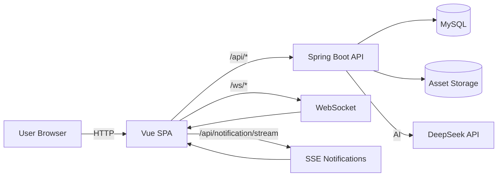
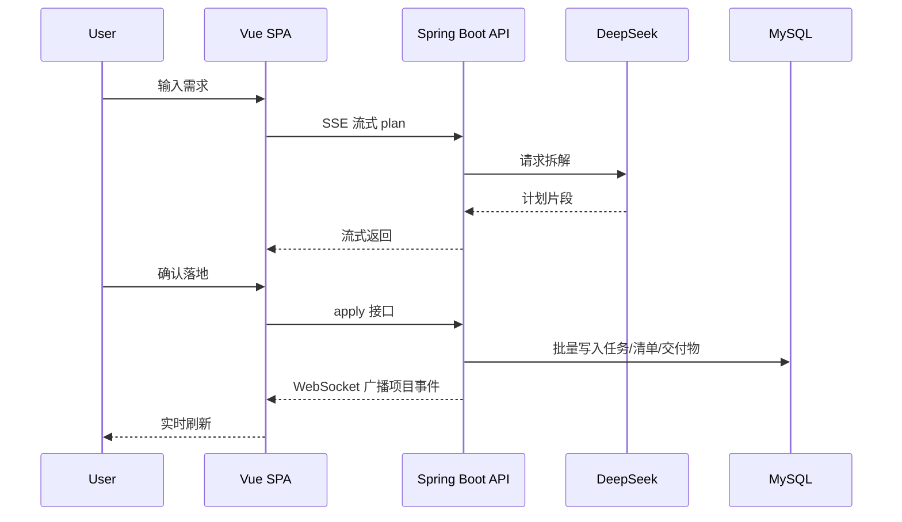

# DevTool Copilot

一个面向团队的智能开发者工作台：把「项目管理 + 协作闭环 + AI 对话内落地」整合到一套产品里，让计划可执行、让执行可追溯、让交付可验收。

> 作品集定位：这是一个能跑、能演示、能讲清架构的完整产品型项目，而不是页面 Demo 或脚手架拼装。

**在线入口**：https://xsw77492-code.github.io/devtool-copilot-workspace/

**技术栈**：Vue 3 + TypeScript + Vite + Pinia + Naive UI · Java 17 + Spring Boot 3 + MyBatis-Plus + MySQL · WebSocket / SSE

---

## 目录

[核心亮点](#核心亮点) · [项目规模](#项目规模) · [界面预览](#界面预览) · [架构设计](#架构设计) · [后端工程亮点](#后端工程亮点) · [AI 能力](#ai-能力) · [快速开始](#快速开始) · [部署](#部署) · [仓库结构](#仓库结构) · [Roadmap](#roadmap) · [FAQ](#faq)

---

## 核心亮点

**1　产品闭环，而不是任务列表**

任务有明确的交付结构：子任务、验收清单、交付物（Link / Doc / PR）、附件与评论协作。看板拖拽推进配合稳定排序，让状态流转不是摆设；里程碑聚合版本任务，天然适配迭代交付的工作方式。

**2　协作与可追溯，可讲清的数据与事件链路**

WebSocket Presence 提供成员在看 / 编辑提示，还原协作产品的在场感；审计日志让关键操作留痕并支持导出；Inbox 把通知变成可处理的待办，避免信息只在弹窗里消失。

**3　AI 不止聊天：对话内「计划 → 确认 → 落地」**

AI 的方向是把建议落地成系统动作，并通过确认机制保持可控。Plan 把需求拆成任务结构；Apply 在确认后创建任务与相关结构；周报、Release Notes、Gate 检查、Inbox 分流都以「预览 → 确认 → 执行」完成协作闭环。

**4　技术选型现代而克制**

前端 Vue 3 + TypeScript + Pinia + Vite + Naive UI，后端 Java 17 + Spring Boot 3 + MyBatis-Plus + MySQL，分层清晰、易于扩展；实时链路用 WebSocket + SSE 拆分，并做跨标签页兜底，能讲清「为什么实时不会乱、不会漏」。

---

## 项目规模

| 维度 | 规模 |
| --- | --- |
| 后端接口 | 36 Controller，249 个 REST 接口 |
| 后端代码 | 436 个 Java 文件，约 25.6k 行 |
| 前端页面 | 51 个 Vue 页面，约 46k 行 |
| 数据模型 | 19 个表初始化器，覆盖任务 / 协作 / 审计 / AI 等领域 |

---

## 界面预览

<details open>
<summary><b>1　Workspace — 项目、我的工作、AI 需求拆解入口聚合</b></summary>


</details>

<details>
<summary><b>2　Kanban — 拖拽移动与排序</b></summary>


</details>

<details>
<summary><b>3　Task Detail — 清单、交付物、附件预览与评论区</b></summary>


</details>

<details>
<summary><b>4　AI Chat — 对话内 Plan → 确认 → 落地</b></summary>


</details>

---

## 架构设计

**系统架构**


```mermaid
flowchart LR
  U[User Browser] -->|HTTP| WEB[Vue SPA]
  WEB -->|/api/*| API[Spring Boot API]
  WEB -->|/ws/*| WS[WebSocket]
  WEB -->|/api/notification/stream| SSE[SSE Notifications]
  API --> DB[(MySQL)]
  API --> ASSET[(Asset Storage)]
  API -->|AI| DS[DeepSeek API]
  WS --> WEB
  SSE --> WEB
```

**一个「闭环动作」是怎么发生的**

以「AI 帮我把需求拆成任务并落地」为例：


```mermaid
sequenceDiagram
  participant U as User
  participant W as Vue SPA
  participant A as Spring Boot API
  participant D as DeepSeek
  participant DB as MySQL
  U->>W: 输入需求
  W->>A: SSE 流式 plan
  A->>D: 请求拆解
  D-->>A: 计划片段
  A-->>W: 流式返回
  U->>W: 确认落地
  W->>A: apply 接口
  A->>DB: 批量写入任务/清单/交付物
  A-->>W: WebSocket 广播项目事件
  W-->>U: 实时刷新
```

**实时链路拆分**

WebSocket 承担 Presence（成员在看 / 编辑提示）与项目事件广播；SSE 承担通知流的实时推送；BroadcastChannel / localStorage 做跨标签页兜底，多开标签页时也能同步刷新。

---

## 后端工程亮点

- 分层清晰：Controller / Service / Mapper 三层，DTO 与 Entity 分离，接口职责单一
- 数据表由代码初始化器统一建表，规避手工 DDL 的不一致
- 全局异常处理与统一响应结构，接口错误可控可读
- 实时链路独立模块化：WebSocket 会话管理、SSE 通知流各司其职

---

## AI 能力

| 能力 | 触发方式 | 落地结果 |
| --- | --- | --- |
| 需求拆解 | 对话输入需求 | 生成任务结构，确认后批量创建 |
| 周报草拟 | 对话请求周报 | 预览 → 确认 → 入库 |
| Release Notes | 里程碑场景 | 从任务 / 交付物聚合，确认后入库 |
| Gate 检查 | 交付前检查 | 定位缺清单 / 缺交付物 / 未完成项 |
| Inbox 分流 | 待办堆积 | 批量分类处理，确认后执行 |

---

## 快速开始

**先决条件**：Node.js、Java 17 + Maven、MySQL 8.x

**后端**

```bash
mvn -DskipTests package
java -jar target/devtool-copilot-backend-0.0.1-SNAPSHOT.jar
```

环境变量：`DB_URL` / `DB_USERNAME` / `DB_PASSWORD`、`JWT_SECRET`、`DEEPSEEK_API_KEY`。完整配置见 [application.yml](src/main/resources/application.yml)。

**前端**

```bash
cd devtool-copilot-web
npm install
VITE_BACKEND_URL=http://127.0.0.1:8085 npm run dev
```

---

## 五分钟体验项目闭环

1. 打开 Workspace，新建一个项目
2. 在 AI Chat 里输入一句需求，看它拆解成任务结构
3. 确认「落地」，任务、清单、交付物批量创建
4. 打开 Kanban 拖拽一张卡片，观察实时同步
5. 打开 Inbox，处理一条通知，完成一次闭环

这一段同时可以作为面试演示的动线。

---

## 部署

仓库提供「阿里云 ECS + Nginx + RDS MySQL」部署模板（含 WS / SSE / HTTPS 的 Nginx 配置与 systemd 守护），见 [deploy/aliyun-ecs-nginx/README.md](deploy/aliyun-ecs-nginx/README.md)。

---

## 仓库结构

- `devtool-copilot-web/`：前端（Vue 3 + Vite）
- `src/main/java/`：后端（Spring Boot）
- `src/main/resources/`：后端配置
- `deploy/`：部署模板
- `mcp/devtoolcopilot-mcp/`：MCP server
- `portfolio/`：个人作品集

---

## Roadmap

**已落地**

- [x] 任务闭环（子任务 / 清单 / 交付物 / 附件 / 评论）
- [x] Kanban 拖拽与稳定排序
- [x] 里程碑与版本聚合
- [x] Inbox 通知聚合与批量处理
- [x] 审计日志与项目动态
- [x] WebSocket Presence + SSE 通知流
- [x] AI 对话内 Plan → 确认 → 落地
- [x] 阿里云 ECS + Nginx 部署模板
- [x] 个人作品集静态页

**规划中**

- [ ] 父子任务 / 层级任务
- [ ] 里程碑发布闭环增强（自动生成 Release Notes）
- [ ] 项目归档与只读访问
- [ ] 部署一键化（Docker / Compose）
- [ ] 生产级观测（日志 / 指标 / 告警）
- [ ] 对外 Demo 站点

---

## FAQ

**这个项目是「项目管理工具」还是「AI 工具」？**

两者都是，但定位更偏「研发交付闭环工具」。AI 的目标不是替代你管理项目，而是把计划 / 汇总 / 检查 / 分流这些重复工作变成可确认、可落地的系统动作。

**AI 会不会误操作？怎么保证可控？**

关键动作默认采用「先预览 → 用户确认 → 执行」的交互，动作与结果尽量做成可追溯记录。

**为什么不做向量库 / 联网检索？**

当前阶段优先保证产品闭环与工程可控性，先把任务 / 协作 / 落地做扎实，再按需引入 RAG / 联网检索。

**能否只把前端部署成静态站点？**

前端可以静态部署，但系统能力依赖后端 API，仍需后端服务与数据库。

---

## 版权声明

本项目为个人原创作品集，全部内容保留完整著作权。允许个人本地学习、技术参考、非商用自用；禁止未经书面许可的商业部署、付费运营、售卖变现，以及抹去或篡改原作者署名与来源链接。

联系方式：Email xsw77492@gmail.com · WeChat mmlki6

---

## English

DevTool Copilot is a developer workspace that unifies project execution into one product: tasks, kanban, subtasks, milestones, deliverables and checklists, attachments, inbox, audit logs, real-time collaboration, and an in-chat AI assistant that can plan and apply changes in a controlled way.

Stack: Vue 3 + Vite (frontend), Java 17 + Spring Boot + MyBatis-Plus + MySQL (backend), WebSocket / SSE (realtime).
