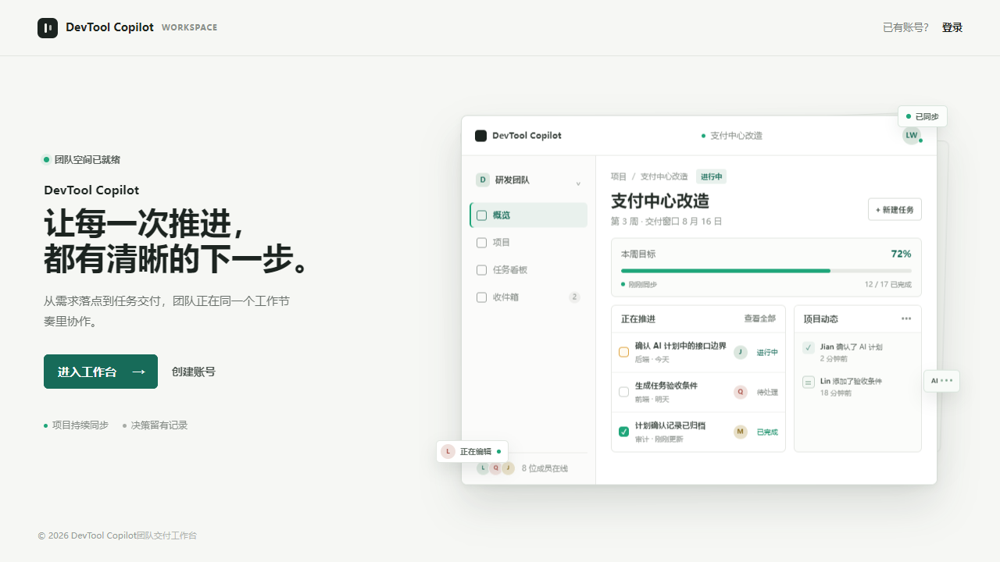
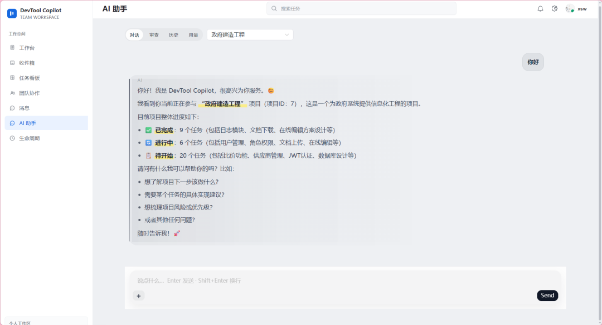
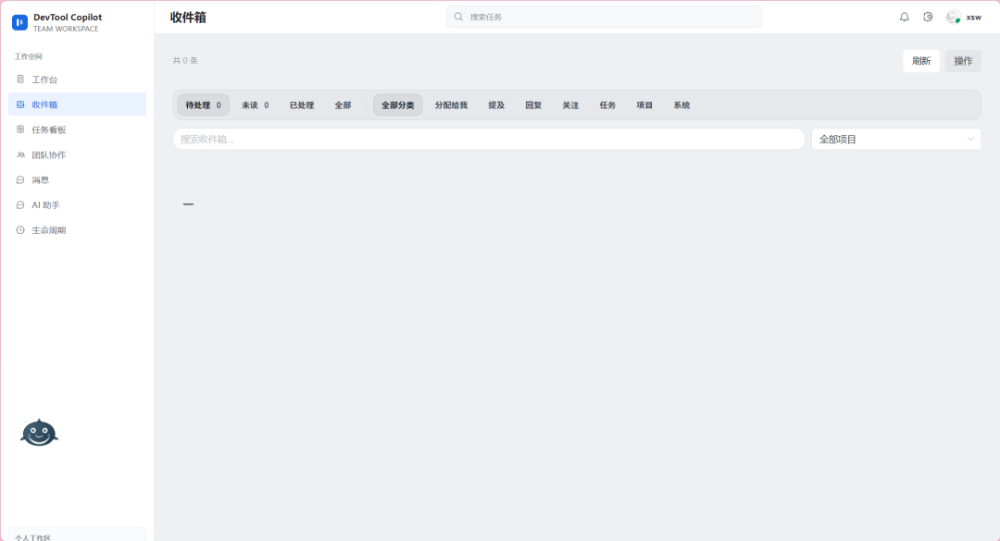
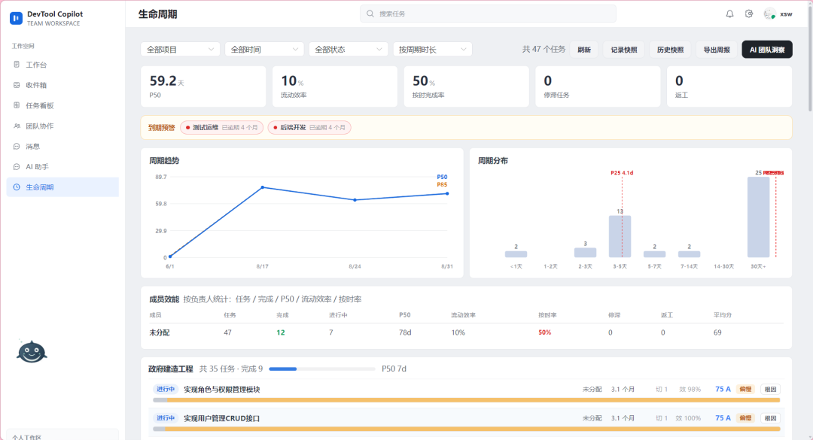
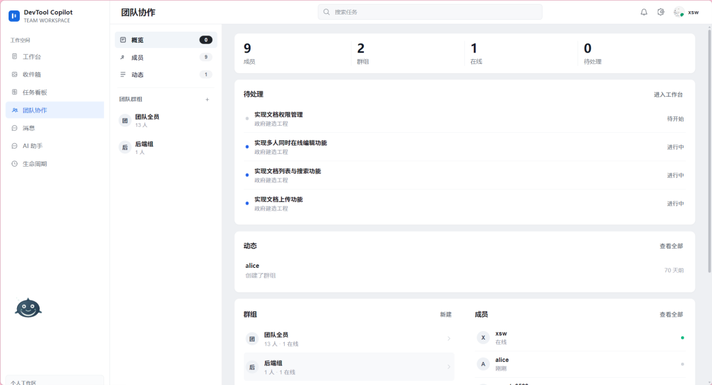
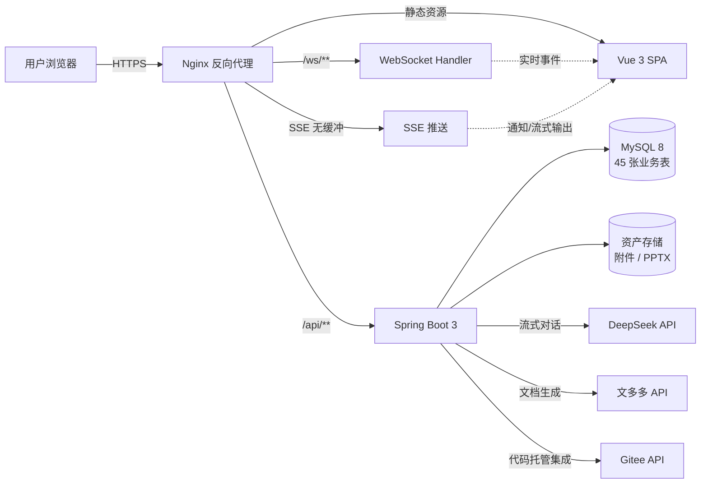
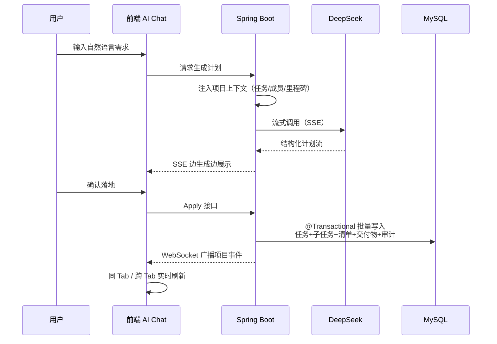

# DevTool Copilot

**AI 原生的团队协作工作台** —— 把「项目管理 + 实时协作 + AI 对话内落地」整合进一套系统，让"计划"可执行、"执行"可追溯、"交付"可验收。

> 一个"能跑、能演示、能讲清架构"的完整产品型项目。前后端共 7 万+ 行代码，独立设计、独立实现、独立部署上线。


**技术栈**　Java 17 · Spring Boot 3 · MyBatis-Plus · MySQL 8 · Vue 3 · TypeScript · WebSocket · SSE

**在线入口**　[图文作品集](https://xsw77492-code.github.io/devtool-copilot-workspace/)　·　[项目源码](https://github.com/xsw77492-code/devtool-copilot-workspace)

[核心亮点](#核心亮点) · [项目规模](#项目规模) · [界面预览](#界面预览) · [架构设计](#架构设计) · [后端工程](#后端工程亮点) · [AI 能力](#ai-能力plan--confirm--apply) · [快速开始](#快速开始) · [五分钟体验闭环](#五分钟体验项目闭环) · [部署](#部署) · [FAQ](#常见问题faq) · [English](#english)

---

## 项目定位

如果你一直在用「Jira / 飞书 / Notion + 各种 Chat 工具」拼凑项目管理，DevTool Copilot 解决的是一个更闭环的问题：

- **任务不只是写标题**：它能拆子任务、挂验收清单、绑交付物（Link / Doc / PR）、支持附件与评论协作
- **协作不只是"通知"**：即时消息、在线状态、项目动态、审计日志沉淀到统一空间，可检索、可导出
- **AI 不只是"给建议"**：它在对话里把计划落地成系统动作（创建任务 / 清单 / 交付物），**可控、可回滚、可验证**

---

## 核心亮点

### 1　产品闭环，不是"任务列表"

- 任务具备完整的交付结构：**子任务 + 验收清单 + 交付物 + 附件 + 评论 @ 协作**
- 看板拖拽推进 + 稳定排序，状态流转不是摆设
- 里程碑聚合版本任务，天然适配"迭代交付"的工作方式
- 生命周期 / 效能分析视图，用数据支持过程复盘

### 2　AI 不止聊天：对话内「计划 → 确认 → 落地」

- **Plan**：自然语言需求 → SSE 流式生成结构化任务计划（任务 / 子任务 / 清单 / 交付物）
- **Confirm**：用户预览并确认，**生成与写入分离，人始终保有最终决定权**
- **Apply**：确认后服务层 `@Transactional` 事务化批量写入，任何一步失败整体回滚，并记录审计
- 周报草拟 / Release Notes 草拟 / Gate 检查 / Inbox 分流：全部以"预览 → 确认 → 执行"完成闭环

### 3　实时协作：按交互方向拆分 SSE 与 WebSocket

- **WebSocket** 承担双向交互：即时消息、已读回执、成员在线状态（Presence）、协同编辑事件
- **SSE** 承担单向推送：AI 流式输出、系统通知（按用户维护 `SseEmitter` 集合精确推送）
- **消息已读位点设计**：会话成员仅保存 `last_read_message_id`，一次已读只更新一行记录，未读数通过 ID 位点计算 —— 避免对历史消息的写放大
- 跨标签页通过 BroadcastChannel / localStorage 事件兜底同步

### 4　技术栈现代但克制，面试讲得清"为什么"

| 层  | 选型                                                         | 为什么                       |
| -- | ---------------------------------------------------------- | ------------------------- |
| 前端 | Vue 3 + TypeScript + Vite + Pinia + Naive UI + TailwindCSS | 组合式 API + 类型安全，产品化 UI     |
| 后端 | Java 17 + Spring Boot 3 + MyBatis-Plus + MySQL 8           | 清晰分层、领域拆分、易扩展             |
| 实时 | WebSocket + SSE + 跨标签页兜底                                   | 双向交互与单向推送各归其位             |
| AI | DeepSeek API（SSE 流式）                                       | Prompt 工程 + 上下文注入 + 结构化输出 |
| 部署 | 阿里云 ECS + Nginx + RDS MySQL + HTTPS                        | WS / SSE 反代调优、systemd 守护  |

---

## 项目规模

> 以下数字均来自仓库真实统计，非估算。

| 指标         | 数量                 | 说明                                |
| ---------- | ------------------ | --------------------------------- |
| 后端代码       | **25,000+ 行**      | 436 个 Java 文件，17 个业务领域模块          |
| 前端代码       | **46,000+ 行**      | Vue 3 + TS，30+ 个页面                |
| REST 接口    | **249 个**          | 覆盖项目协作完整链路                        |
| Controller | **36 个**           | 按用户 / 项目 / 任务 / 消息 / AI / 审计等领域拆分 |
| 数据表        | **45 张**           | 启动时自动建表、补齐字段、写入种子数据               |
| 事务化写入口     | AI Apply / 任务批量操作等 | 多步写入原子性保障                         |

---

## 界面预览

**产品首页** —— 完整的产品化入口：团队空间状态、登录注册与工作台预览。



**任务看板（Kanban）** —— TODO / DOING / DONE 三列拖拽移动与重排，右侧聚合里程碑与发布记录。


**任务详情（Task Detail）** —— 子任务 + 验收清单 + 交付物 + 附件在线预览 + 评论协作，任务从"记录"变成"交付闭环"。


<details>

<summary><b>更多界面（点击展开）</b></summary>

**即时消息** —— WebSocket 实时同步，已读回执，附件传输


**AI 助手** —— 对话、代码审查、历史记录、用量统计统一嵌入工作台



**收件箱** —— 聚合待处理事项，批量已读 / 处理，跳转定位



**效能分析** —— 基于任务生命周期计算周期、完成率与趋势



**团队协作** —— 成员、角色与在线状态



</details>

---

## 架构设计

### 系统架构


```mermaid
flowchart LR
  U[用户浏览器] -->|HTTPS| N[Nginx 反向代理]
  N -->|静态资源| WEB[Vue 3 SPA]
  N -->|/api/**| API[Spring Boot 3]
  N -->|/ws/**| WS[WebSocket Handler]
  N -->|SSE 无缓冲| SSE[SSE 推送]
  API --> DB[(MySQL 8<br/>45 张业务表)]
  API --> ASSET[(资产存储<br/>附件 / PPTX)]
  API -->|流式对话| DS[DeepSeek API]
  API -->|文档生成| WD[文多多 API]
  API -->|代码托管集成| GT[Gitee API]
  WS -.实时事件.-> WEB
  SSE -.通知/流式输出.-> WEB
```

### 一次"AI 闭环动作"的完整链路


```mermaid
sequenceDiagram
  participant U as 用户
  participant F as 前端 AI Chat
  participant B as Spring Boot
  participant D as DeepSeek
  participant DB as MySQL

  U->>F: 输入自然语言需求
  F->>B: 请求生成计划
  B->>B: 注入项目上下文（任务/成员/里程碑）
  B->>D: 流式调用（SSE）
  D-->>B: 结构化计划流
  B-->>F: SSE 边生成边展示
  U->>F: 确认落地
  F->>B: Apply 接口
  B->>DB: @Transactional 批量写入<br/>任务+子任务+清单+交付物+审计
  B-->>F: WebSocket 广播项目事件
  F->>F: 同 Tab / 跨 Tab 实时刷新
```

### 模块地图（路由）

| 模块          | 路由                                   | 说明                    |
| ----------- | ------------------------------------ | --------------------- |
| Workspace   | `/dashboard`                         | 项目列表 + 我的工作 + AI 规划入口 |
| AI          | `/ai`                                | 对话 / 代码审查 / 历史 / 用量统计 |
| Kanban      | `/board`                             | 看板拖拽与排序               |
| Inbox       | `/inbox`                             | 待处理事项聚合与批量处理          |
| Projects    | `/projects/:id`                      | 项目空间                  |
| Task Detail | `/projects/:projectId/tasks/:taskId` | 任务交付闭环                |

---

## 后端工程亮点

**认证与访问控制**

- **JWT 无状态认证**：自定义拦截器统一解析令牌，写入 `ThreadLocal` 用户上下文，请求结束清理 —— 避免线程池复用导致用户串号
- **BCrypt 加盐哈希**存储密码；登录失败计数与锁定时间进入安全策略
- WebSocket 握手阶段通过 `JwtQueryHandshakeInterceptor` 完成鉴权
- 前端路由守卫 + 后端接口鉴权双层兜底

**事务边界与数据一致性**

- 多步写入由服务层 `@Transactional` 统一包裹：AI Apply 时任务、子任务、清单、交付物、审计记录**一并写入**
- 任何一步失败整体回滚，不遗留半成品数据
- 复杂查询通过 MyBatis-Plus 与 XML SQL 组合实现

**领域模型与工程组织**

- 17 个业务领域模块（user / project / task / chat / notification / ai / audit / milestone / release / inbox / asset / integration …），不把复杂业务塞进单一模块
- 各域自带 `*TableInitializer`：启动时自动检查建表、补齐字段、写入种子数据，**新环境只需配置 MySQL 连接即可启动联调**
- `@RestControllerAdvice` 全局异常处理 + 统一响应包装，接口返回格式收敛
- Gitee 集成模块：对接代码托管平台，交付物可追溯至真实代码仓库

---

## AI 能力：Plan → Confirm → Apply

核心设计不是"调一次模型"，而是**生成计划与写入数据分离**的受控闭环：

```
提出需求 ──► 生成计划（SSE 流式） ──► 人工确认 ──► 事务化落地 + 审计
```

| AI 能力         | 交互方式                 | 落地动作                       |
| ------------- | -------------------- | -------------------------- |
| 需求拆解          | 对话内流式生成计划            | 确认后批量创建任务 / 子任务 / 清单 / 交付物 |
| 周报草拟          | 预览 → 确认              | 确认后入库                      |
| Release Notes | 从里程碑任务 / 交付物聚合草拟     | 确认后资产化入库                   |
| Gate 检查       | 检查缺清单 / 缺交付物 / 未完成任务 | 确认后一键补齐占位                  |
| Inbox 分流      | AI 建议处理策略            | 确认后批量处理                    |
| 代码审查          | 对话内审查                | 结果沉淀至历史记录                  |
| 用量统计          | 自动                   | Token 用量可视化                |

配套 `mcp/devtoolcopilot-mcp/`：MCP Server（简易版），用于 AI 工具调用对接。

---

## 快速开始

**先决条件**：Node.js 18+ · Java 17 + Maven · MySQL 8.x

**后端**

```bash
# 1. 创建数据库
CREATE DATABASE devtool_copilot DEFAULT CHARSET utf8mb4;

# 2. 配置环境变量（见 .env.example）
#    DB_URL / DB_USERNAME / DB_PASSWORD
#    JWT_SECRET（生产环境务必修改）
#    DEEPSEEK_API_KEY（启用 AI 对话）
#    WENDUODUO_API_KEY / WENDUODUO_TEMPLATE_ID（启用 PPTX 生成）

# 3. 构建并启动（默认端口 8085）
mvn -DskipTests package
java -jar target/devtool-copilot-backend-0.0.1-SNAPSHOT.jar
```

数据表会在首次启动时自动初始化。后端完整配置见 [src/main/resources/application.yml](src/main/resources/application.yml)。

**前端**

```bash
cd devtool-copilot-web
npm install
VITE_BACKEND_URL=http://127.0.0.1:8085 npm run dev
```

> Windows PowerShell 若遇 `npm.ps1` 执行策略问题，可改用 `npm.cmd`。

---

## 五分钟体验项目闭环

克隆并启动后，按这条动线走一遍，可以完整体验「需求 → 计划 → 落地 → 交付 → 追溯」的核心链路：

1. **创建项目**：进入 Workspace，新建一个项目并邀请成员
2. **AI 拆解需求**：打开 AI 对话，输入一段自然语言需求，观察 SSE 流式生成的结构化计划（任务 / 子任务 / 清单 / 交付物）
3. **确认落地**：点击确认，计划事务化写入，看板与项目动态实时刷新（无需手动刷新页面）
4. **推进交付**：打开看板拖拽任务至 DONE；进入任务详情勾选验收清单、挂交付物、上传附件
5. **处理待办**：打开 Inbox，批量处理协作过程沉淀的待办事项
6. **回看过程**：打开审计日志导出 CSV，或查看效能分析面板 —— 整个过程可追溯、可复盘

> 这也是面试现场推荐的演示顺序：每一步对应一个可深挖的技术点（流式输出、事务一致性、WebSocket 广播、位图式已读、审计设计）。

---

## 部署

仓库内置两套部署方案：

**生产环境**：阿里云 ECS + Nginx + RDS MySQL 模板，已实际部署验证：

- 前端：Nginx 静态资源托管
- 后端：Spring Boot jar（`127.0.0.1:8085`），systemd 守护
- 反代：`/` → SPA；`/api/**` → 后端；`/ws/**` → WebSocket（Upgrade 头转发）；SSE 关闭代理缓冲
- 数据库：RDS MySQL，HTTPS 全站加密

完整步骤与配置文件：[deploy/aliyun-ecs-nginx/README.md](deploy/aliyun-ecs-nginx/README.md)

**作品集站点**：[GitHub Pages](https://xsw77492-code.github.io/devtool-copilot-workspace/) 由 GitHub Actions 自动发布 —— 推送 `portfolio/` 目录的变更即触发流水线（见 [.github/workflows/deploy-portfolio.yml](.github/workflows/deploy-portfolio.yml)）。

---

## 仓库结构

```
├── devtool-copilot-web/     # 前端（Vue 3 + Vite + TS）
├── src/main/java/com/devtoolcopilot/
│   ├── user/                # 用户与认证
│   ├── project/             # 项目与成员
│   ├── task/                # 任务/子任务/清单/交付物
│   ├── chat/                # 即时消息与已读位点
│   ├── realtime/            # WebSocket / Presence / 事件广播
│   ├── notification/        # SSE 通知流
│   ├── ai/                  # AI 对话/拆解/审查/agent
│   ├── audit/               # 审计日志
│   ├── inbox/               # 收件箱
│   ├── milestone/ release/  # 里程碑与发布
│   ├── integration/gitee/   # Gitee 集成
│   └── ...                  # asset / attachment / dashboard / kb 等
├── src/main/resources/      # application.yml
├── deploy/                  # Nginx / systemd / env 部署模板
├── .github/workflows/       # GitHub Actions：作品集站点自动发布
├── mcp/                     # MCP Server（AI 工具调用对接）
└── portfolio/               # 作品集页面与产品截图（GitHub Pages 自动部署）
```

---

## Roadmap

**已落地**

- [x] 任务闭环：子任务 / 验收清单 / 交付物 / 附件 / 评论协作
- [x] 看板拖拽移动与稳定排序
- [x] 里程碑与发布记录（Release Notes 草拟）
- [x] 实时协作：WebSocket Presence + SSE 通知流
- [x] AI Plan → Confirm → Apply 受控闭环
- [x] 审计日志留痕与 CSV 导出
- [x] 任务生命周期效能分析
- [x] Gitee 代码托管集成
- [x] 阿里云 ECS + Nginx + RDS 生产部署模板

**规划中**

- [ ] 父子任务 / 层级任务：更强的拆解与聚合能力
- [ ] 里程碑发布闭环增强：验收清单固化
- [ ] 项目归档：已结束项目只读访问
- [ ] Docker / Compose 一键部署
- [ ] 生产级观测：日志 / 指标 / 告警与回滚策略

---

## 常见问题（FAQ）

**Q1：这个项目是"项目管理工具"，还是"AI 工具"？**

两者都是，但定位更偏**研发交付闭环工具**。AI 的目标不是替代你管理项目，而是把"计划 / 汇总 / 检查 / 分流"这些重复工作变成可确认、可落地的系统动作。

**Q2：AI 会不会误操作？怎么保证可控？**

关键动作默认"先预览 → 用户确认 → 执行"；所有落地动作都会写入任务 / 清单 / 交付物 / 动态 / 审计，可追溯、可复盘。

**Q3：为什么不做向量库 / 联网检索？**

当前阶段优先保证产品闭环与工程可控性：先把任务 / 协作 / 落地做扎实，再按需引入 RAG 能力。

**Q4：能只把前端部署成静态站点吗？**

前端可以静态部署，但系统能力依赖后端 API 与数据库，仍需后端服务。

---

## License

All rights reserved. 商业使用需授权，私有化部署 / 定制开发请单独联系。

Email: <xsw77492@gmail.com>

---


## English

**DevTool Copilot** is an AI-native team workspace that unifies project execution into one product: tasks, kanban, subtasks, milestones, deliverables & checklists, attachments, real-time chat & presence, inbox, audit logs — plus an in-chat AI assistant that turns natural-language requirements into system actions through a controlled **Plan → Confirm → Apply** pipeline (SSE streaming, transactional writes, auditable records).

[Online portfolio](https://xsw77492-code.github.io/devtool-copilot-workspace/) · [Source code](https://github.com/xsw77492-code/devtool-copilot-workspace)

- **Frontend**: Vue 3 + TypeScript + Vite + Pinia + Naive UI + TailwindCSS (30+ pages)
- **Backend**: Java 17 + Spring Boot 3 + MyBatis-Plus + MySQL 8 (36 controllers, 249 REST endpoints, 45 tables across 17 domain modules)
- **Realtime**: WebSocket (chat / presence / collab events) + SSE (AI streaming / notifications), with read-cursor design (`last_read_message_id`) to avoid write amplification
- **Deployment**: Alibaba Cloud ECS + Nginx + RDS MySQL + HTTPS, WebSocket/SSE reverse-proxy tuned

Built end-to-end as a solo full-stack project: domain modeling, transactional consistency, realtime messaging, AI integration, and cloud deployment.
